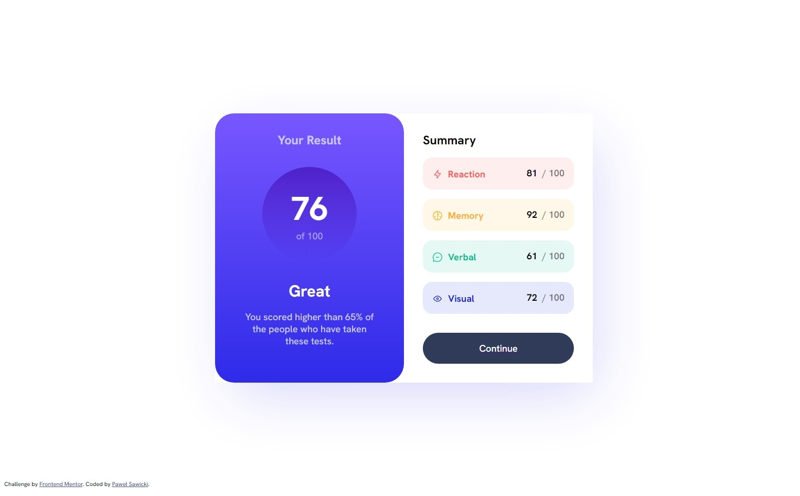
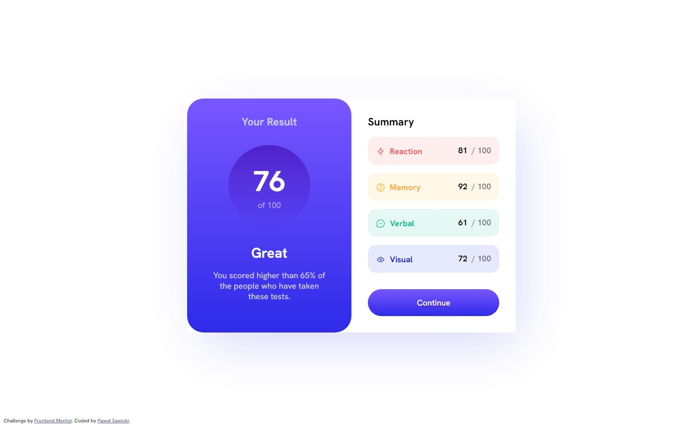
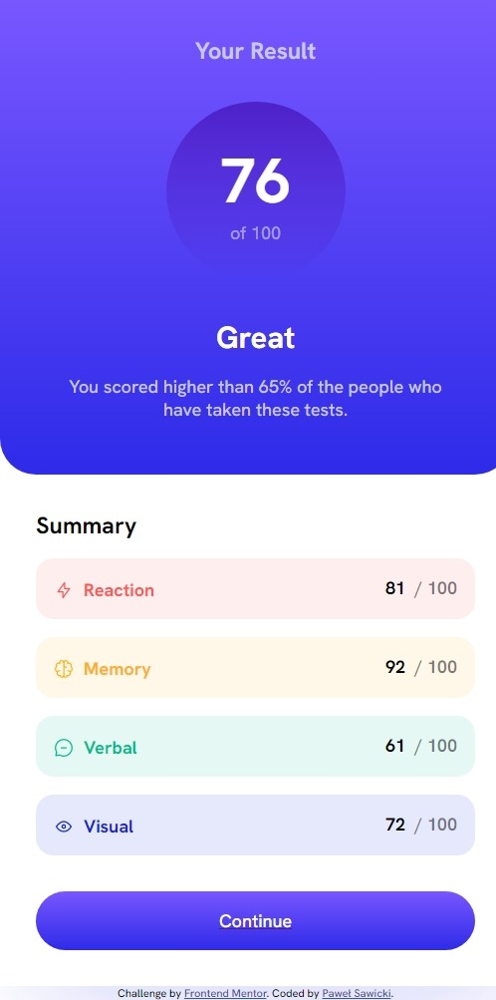

# Frontend Mentor - Results summary component solution

This is a solution to the [Results summary component challenge on Frontend Mentor](https://www.frontendmentor.io/challenges/results-summary-component-CE_K6s0maV), which took roughly 4 hours.

## Table of contents

- [Overview](#overview)
  - [The challenge](#the-challenge)
  - [Screenshot](#screenshot)
- [My process](#my-process)
  - [Built with](#built-with)
  - [What I learned](#what-i-learned)
  - [Useful resources](#useful-resources)
- [Author](#author)

## Overview

### The challenge

Users should be able to:

- View the optimal layout for the interface depending on their device's screen size
- See hover and focus states for all interactive elements on the page

### Screenshot

## My process

### Built with

- Semantic HTML5 markup
- SCSS
- VSCode
- JS

### What I learned

1. How to use JS to:
  1. import json file
  2. iterate over json items
  3. get elements from HTML and write values from JSON into HTML dynamically

'''js
fetch('data.json')
    .then(response => response.json())
    .then(data => {
      data.forEach((item, index) => {
        const score = item.score;
        const scoreElement = document.getElementById('score' + (index + 1));
        scoreElement.textContent = score;

        const category = item.category;
        const categoryElement = document.getElementById('category' + (index + 1));
        categoryElement.textContent = category;

        const icon = item.icon;
        const iconElement = document.getElementById('icon' + (index + 1));
        iconElement.style.src = icon;
      });
    })
'''

### Useful resources

- [ChatGPT](https://chat.openai.com/) - Helps me to explain evething i need to learn.

## Author

- LinkedIn - [Paweł Sawicki](https://www.linkedin.com/in/pawe%C5%82-sawicki-6129b9a8/)
- Frontend Mentor - [@pavlonatorPL](https://www.frontendmentor.io/profile/pavlonatorPL)
